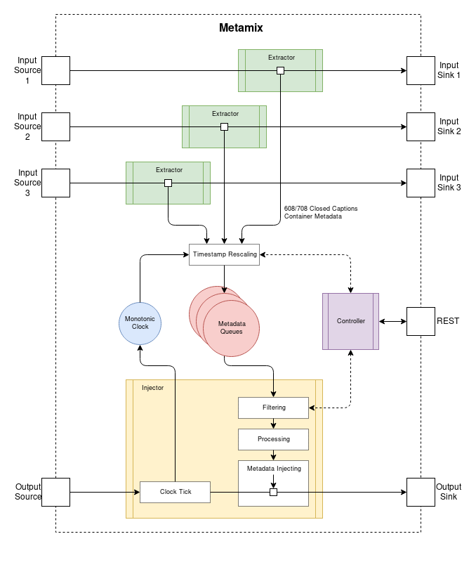
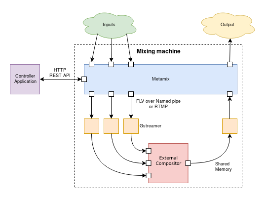

# Metamix

## Table of Contents

<!-- toc -->

- [Application Architecture](#application-architecture)
- [Building](#building)
  - [Prerequisites](#prerequisites)
  - [Building Metamix](#building-metamix)
  - [Docker & Docker Compose Demo](#docker--docker-compose-demo)
- [Deploying](#deploying)
- [Configuring and Running Metamix](#configuring-and-running-metamix)
  - [Configuration file](#configuration-file)
  - [Run-time changeable options](#run-time-changeable-options)
- [Input capabilities](#input-capabilities)
- [Virtual inputs](#virtual-inputs)
- [REST API](#rest-api)
  - [GET `/input`](#get-input)
  - [GET `/input/current`](#get-inputcurrent)
  - [POST `/input/current`](#post-inputcurrent)
  - [POST `/input/restart`](#post-inputrestart)
  - [GET `/stats`](#get-stats)
  - [GET `/config`](#get-config)
  - [POST `/config`](#post-config)
- [Utilities](#utilities)
  - [traceparser](#traceparser)
  - [fbremix](#fbremix)

<!-- tocstop -->

## Application Architecture



Metamix is built as single-process multi-threaded monolithic application.

It takes multiple predefined inputs (_Input Sources_) that _flow_ through the _Extractor_ threads. Each input there is demuxed, processed by a set of lightweight processors, muxed and sent to corresponding _Input Sink_.

Extracted metadata has its timestamps processed in extractor threads and is then enqueued on the _Metadata Queue_.

Input Sinks forward data to some audio/video mixer, whose output is send to the _Output Source_. It is processed inside the _Injector_ thread, that controls internal clock, demuxes output, pops matching metadata from queue, injects closed captions and metadata, muxes and sends it to the _Output Sink_. From there, the stream is returned back to the world.

The whole process can be controlled via simple HTTP [REST API](#rest-api), by default exposed on `3445` port. Note it does not do any authentication or encryption.

See [Deploying](#deploying) section for broader overview.

**No control flow is done within Metamix**, the connector between input sinks and output source **is expected** to work as such one. If input sinks and output source are independent, horrible things may happen. For example the operating system may give more CPU time to Injector thread, and hence output stream will be later in time than inputs resulting in no metadata being mixed.

It has been found that **Metamix breaks when inputs contain B-frames**. Because B-frames do not make sense in live streaming, suggested solution is to put transcoders, that remove B-frames, in front of Metamix.

## Building

Metamix is a C++ 17 application, built to single statically linked binary except libc and FFmpeg due to licensing constraints. The application does not depend on operating system specifics, though development and testing is done on Linux only. CMake is used as build system.

### Prerequisites

- CMake >= 3.10 & Make or Ninja
- GCC >= 8.0
- Boost 1.66.0 static, multi-threaded (Boost.Log, Boost.ProgramOptions, Boost.System, Boost.UnitTest for testing)
- FFmpeg >= 4.0

Older versions might work, but no guarantees are made. Note that CMake script checks dependencies versions.

Recommended tools for development:

- [clang-format](https://clang.llvm.org/docs/ClangFormat.html)
- [just](https://github.com/casey/just)
- [ripgrep](https://github.com/BurntSushi/ripgrep)

### Building Metamix

```bash
cd metamix-source-directory
mkdir build && cd build
cmake -DCMAKE_BUILD_TYPE=Release ..
make
sudo make install
```

To get dependencies and build Metamix on Ubuntu LTS 16.04 use the following commands:

```bash
# Add ppa for current gcc and ffmpeg
sudo add-apt-repository ppa:jonathonf/ffmpeg-4 -y
sudo add-apt-repository ppa:ubuntu-toolchain-r/test -y
sudo apt-get update
sudo apt-get install gcc-8 g++-8 python-pip ninja-build ffmpeg libavutil-dev libavformat-dev libavcodec-dev -y
# Set gcc-8 as default
sudo update-alternatives --install /usr/bin/gcc gcc /usr/bin/gcc-8 60
sudo update-alternatives --install /usr/bin/gcc gcc /usr/bin/gcc-5 40
sudo update-alternatives --install /usr/bin/g++ g++ /usr/bin/g++-8 60
sudo update-alternatives --install /usr/bin/g++ g++ /usr/bin/g++-5 40
# Install cmake using python-pip
pip install --upgrade cmake
# Build Boost 1.66.0 from sources
wget https://dl.bintray.com/boostorg/release/1.66.0/source/boost_1_66_0.tar.bz2
tar xfj boost_1_66_0.tar.bz2
cd boost_1_66_0
./bootstrap.sh --with-libraries=log,program_options,system,test,thread
./b2
cd ..
# Build metamix
mkdir build && cd build
cmake -DCMAKE_BUILD_TYPE=Release -DBOOST_ROOT=../boost_1_66_0 \
    -DCPACK_PACKAGE_FILE_NAME=metamix -G "Ninja" ..
ninja
cpack
```

Note that commands above change the default gcc (and g++) version to 8.
You can use `update-alternatives` to switch between versions.

The last command creates `metamix.tar.gz` archive with `metamix` binary.
To use binary release (available for download under tags) installing the following
ffmpeg libraries from PPA should suffice:

```bash
sudo add-apt-repository ppa:jonathonf/ffmpeg-4 -y
sudo apt-get update
sudo apt-get install libavcodec58 libavformat58 libavutil56
```

### Docker & Docker Compose Demo

A Docker image with Metamix installed (based on Fedora 28) is available.

Additionally a Docker Compose set up is provided, that shows an example deployment of Metamix. It uses simple FFmpeg video test for simplicity. Note the demo depends on multimedia files that are not included in the source repository.

## Deploying



The diagram above shows how typical deployment scenario of Metamix application looks like.

As a FFmpeg-based application, Metamix supports various input/output mediums, hence exact details how multimedia is passed to/from the application is open for specific needs.

Metamix is configured via command line parameters and/or configuration file. See [Configuring and Running Metamix](#configuring-and-running-metamix) for details.

The controller application communicates with Metamix over HTTP REST API. It allows for inspecting and controlling Metamix state. See [REST API](#rest-api) section for API documentation.

## Configuring and Running Metamix

```
$ metamix -h
usage: metamix [options]

Generic options (cannot be set via configuration file):
  -c [ --config-file ] path load configuration file
  -h [ --help ]             show help message and exit
  -v [ --version ]          show version information and exit

System options:
  --http-address ip (=0.0.0.0) REST API listen address
  --http-port port (=3445)     REST API listen port
  --starting-input name        name of the first input which metadata to pass
  --log level (=info)          logging severity level, must be one of: trace,
                               debug, info, warning, error, fatal
  --log-thread name            show logs only from specified thread
  --no-restart                 don't restart streams

Specifying inputs (at least one required, replace * with input name):
  --input.*.source url          input source url
  --input.*.sink url            input sink url
  --input.*.sourceformat format input source format, or auto detect
  --input.*.sinkformat format   input sink format, or auto detect

Specifying output (required):
  --output.source url               output source url
  --output.sink url                 output sink url
  --output.sourceformat format      output source format, or auto detect
  --output.sinkformat format        output sink format, or auto detect
  --output.ts_adjustment ticks (=0) constant time offset of injected metadata,
                                    expressed in ticks with time base of 90kHz,
                                    may be negative
```

Inputs are declared by specifying `--input.X.source` and `--input.X.sink` options, where `X` is an input name. Often, `--input.X.sourceformat` and `--input.X.sinkformat` options must be provided if FFmpeg is not be able to probe them. The same applies to output configuration. Mind that names of [virtual inputs](#virtual-inputs) are reserved.

By default the `clear` virtual input is mixed on application start. This can be changed with `--starting-input X` option.

### Configuration file

Metamix can be configured via command line arguments and/or configuration file. Options from configuration file have higher priority than command line. Configuration file follows an INI-like [Boost Program Options](https://www.boost.org/doc/libs/1_66_0/doc/html/program_options/overview.html#id-1.3.31.5.10.2) syntax.

Example configuration file:

```ini
# To run: metamix -c config.ini

starting-input=bar
log=debug

[input.foo]
source=rtmp://localhost/live/inputSource0
sink=rtmp://localhost/live/inputSink0
sourceformat=flv
sinkformat=flv

[input.bar]
source=rtmp://localhost/live/inputSource1
sink=rtmp://localhost/live/inputSink1
sourceformat=flv
sinkformat=flv

[output]
source=rtmp://localhost/live/outputSource
sink=rtmp://localhost/live/outputSink
sourceformat=flv
sinkformat=flv
```

### Run-time changeable options

Some configuration options can be changed while Metamix is running, using `/config` REST API endpoint.

| Option         | Command line option    | Type  | Description                                                                                                                                                                                                                                                                                                   |
| -------------- | ---------------------- | ----- | ------------------------------------------------------------------------------------------------------------------------------------------------------------------------------------------------------------------------------------------------------------------------------------------------------------- |
| `tsAdjustment` | `output.ts_adjustment` | int64 | Constant time offset of injected metadata, expressed in ticks with time base of 90kHz. Positive values mean that metadata will appear later in output stream than they were in input stream. Negative values - earlier. Zero (default) means Metamix tries to put metadata exactly at the same point in time. |

## Input capabilities

Metamix supports mixing of several kinds of metadata. Inputs are not required to provide every kind of metadata possible, the set of provided kinds is provided via a notion of _input capabilities_. Input capabilities may change during run-time, for example when input source goes down, and after restart it does not include some streams.

| Capability      | Description                                                              |
| --------------- | ------------------------------------------------------------------------ |
| `closedCaption` | This input provides EIA608/CEA708 closed captions.                       |
| `adMarker`      | This input provides ad markers, usually as SCTE-35 splice info sections. |

## Virtual inputs

Metamix provides several virtual, always-on inputs for utility use. Virtual inputs ids and names are predefined, starting from 0. User-defined inputs have ids assigned _after_ virtual inputs.

| Id  | Name    | Description                                                                                                                            |
| --- | ------- | -------------------------------------------------------------------------------------------------------------------------------------- |
| 0   | `clear` | Continuously issues CC Reset EIA608/CEA708 commands and SCTE-35 NULL packets. Useful for manual clearing output closed captions state. |

## REST API

Metamix exposes simple REST API for real-time control of mixing process. By default app listens on `0.0.0.0:3445`, this setting can be changed with `--http-address` and `--http-port` command line options.

### GET `/input`

Get list of all input streams.

```bash
$ curl -XGET http://localhost:3445/input
[
  {
    "id": 0,
    "name": "clear",
    "sink": "",
    "sinkFormat": "",
    "source": "",
    "sourceFormat": "",
    "isVirtual": true,
    "caps": {
      "adMarker": false,
      "closedCaption": true
    }
  },
  {
    "id": 1,
    "name": "food",
    "sink": "rtmp://rtmp/live/insink1",
    "sinkFormat": "flv",
    "source": "rtmp://rtmp/live/insrc1",
    "sourceFormat": "flv",
    "isVirtual": false,
    "caps": {
      "adMarker": true,
      "closedCaption": true
    }
  },
  {
    "id": 2,
    "name": "bipbop",
    "sink": "rtmp://rtmp/live/insink2",
    "sinkFormat": "flv",
    "source": "rtmp://rtmp/live/insrc2",
    "sourceFormat": "flv",
    "isVirtual": false,
    "caps": {
      "adMarker": false,
      "closedCaption": true
    }
  }
]
```

For details about particular fields refer to the documentation of the [`GET /input/current`](#get-inputcurrent) endpoint.

### GET `/input/current`

Get information about current input stream for each metadata kind.

```bash
$ curl -XGET http://localhost:3445/input/current
{
  "adMarker": {
    "id": 1,
    "name": "food",
    "sink": "rtmp://rtmp/live/insink1",
    "sinkFormat": "flv",
    "source": "rtmp://rtmp/live/insrc1",
    "sourceFormat": "flv",
    "isVirtual": false,
    "caps": {
      "adMarker": true,
      "closedCaption": true
    }
  },
  "closedCaption": {
    "id": 0,
    "name": "clear",
    "sink": "",
    "sinkFormat": "",
    "source": "",
    "sourceFormat": "",
    "isVirtual": true,
    "caps": {
      "adMarker": false,
      "closedCaption": true
    }
  }
}
```

| Field          | Description                                                                                          |
| -------------- | ---------------------------------------------------------------------------------------------------- |
| `id`           | Numerical input identifier.                                                                          |
| `name`         | Input name, as passed in Metamix [configuration](#configuring-and-running-metamix).                  |
| `sink`         | URL where Metamix forwards processed input data. Empty string for [virtual inputs](#virtual-inputs). |
| `sinkFormat`   | Name of the FFmpeg format used for sink handle. Empty if automatically detected.                     |
| `source`       | URL from which Metamix gets input data. Empty string for [virtual inputs](#virtual-inputs).          |
| `sourceFormat` | Name of the FFmpeg format used for source handle. Empty if automatically detected.                   |
| `isVirtual`    | Flag whether this input is [virtual](#virtual-inputs).                                               |
| `caps`         | A set of flags indicating input [capabilities](#input-capabilities) at this moment.                  |

### POST `/input/current`

Change current input stream, either for each metadata kind, or for particular ones, using either input id or input name.

To set current input for all kinds:

```bash
$ curl -XPOST http://localhost:3445/input/current -d '{"id": 0}'
{ "ok": true }

$ curl -XPOST http://localhost:3445/input/current -d '{"name": "bipbop"}'
{ "ok": true }
```

To set current input for specific kind:

```bash
$ curl -XPOST http://localhost:3445/input/current -d '{"closedCaption": {"id": 0}}'
{ "ok": true }

$ curl -XPOST http://localhost:3445/input/current -d '{"adMarker": {"name": "bipbop"}}'
{ "ok": true }
```

Current input for multiple kinds may be changed in single transaction:

```bash
$ curl -XPOST http://localhost:3445/input/current -d '{"closedCaption": {"id": 0}, "adMarker": {"name": "bipbop"}}'
{ "ok": true }
```

### POST `/input/restart`

Force input restart (by restarting input extractor thread). Input is given either by id or name.

```bash
$ curl -XPOST http://localhost:3445/input/restart -d '{"id": 1}'
{ "ok": true }
```

```bash
$ curl -XPOST http://localhost:3445/input/restart -d '{"name": "bipbop"}'
{ "ok": true }
```

Virtual inputs cannot be restarted, though this command silently accepts restart requests for them:

```bash
$ curl -XPOST http://localhost:3445/input/restart -d '{"name": "clear"}'
{ "ok": true }
```

### GET `/stats`

Get numerical statistics about various system components.

```bash
$ curl -XGET http://localhost:3445/stats
{
  "clockNow": 237240,
  "queueSize": {
    "adMarker": 0,
    "closedCaption": 132
  }
}
```

| Field       | Description                                                                                                                                                                                                                                                                                                                               |
| ----------- | ----------------------------------------------------------------------------------------------------------------------------------------------------------------------------------------------------------------------------------------------------------------------------------------------------------------------------------------- |
| `clockNow`  | Current value of Metamix system clock. It has time rate of 90kHz and resolution of ~649.5 average Gregorian millennia. System clock is driven by output source feed. Irregular ticks (both by value and by time delay between ticks), or no changes at all are symptoms of problems with output source stream.                            |
| `queueSize` | Number of metadata items stored currently in metadata queues of each kind. Higher numbers (in thousands) mean data congestion, potentially resulting in big output delays. Very high numbers (tens of thousands and more) may be a symptom of Metamix and/or set-up bug as probably the system does not pull any metadata from the queue. |

### GET `/config`

Get [run-time changeable configuration options](#run-time-changeable-options) values.

```bash
$ curl -XGET http://localhost:3445/config
{
  "tsAdjustment": 180000,
}
```

### POST `/config`

Change values of some [run-time changeable configuration options](#run-time-changeable-options). Multiple options may be passed in single request, they will be set within a transaction.

```bash
$ curl -XPOST http://localhost:3445/config -d '{"tsAdjustment": 0}'
{ "ok": true }
```

## Utilities

This repository also contains some utilities useful when working with Metamix.

### traceparser

The [`util/traceparser.py`](./util/traceparser.py) program is a Python 3.5 script. It consumes Metamix logs on its standard input and produces CSV data on its standard output, presenting all events related to metadata queue together. This data is useful when working out timing issues.

```bash
util/traceparser.py < metamix.log > metamix.csv
```

### fbremix

The [FBremix](./util/fbremix) program Transcodes input for publishing to Facebook Live, properly preserving closed captions and metadata. FBremix is bundled with installation packages since Metamix 1.2.2

```
Usage: fbremix [options] INPUT OUTPUT
Transcodes input for publishing to Facebook Live, properly preserving closed captions and metadata.
Input and output streams/files must be FLV-based.

  -M  set path to metamix executable, overriding METAMIX environment variable
  -F  set path to ffmpeg executable, overriding FFMPEG environment variable
  -P  change directory where FBremix will place child processes PIDs, defaults to /tmp
  -h  display this help and exit
  -v  output version information and exit
```
